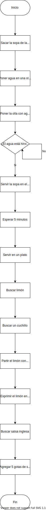

#   Corto 1 - Sopa instantánea
##   Algoritmo de preparación

1.  Sacar la sopa de donde esté guardada
2.  Poner en una olla agua y ponerla a hervir
3.  Cuando el agua esté hirviendo, abrir la sopa y servirle el agua.
4.  Buscar y partir un limón
5.  Exprimir el limón en la sopa
6.  Buscar salsa inglesa
7.  Echar un poco de salsa inglesa a la sopa

##   Diagrama de bloques

<p align="center">
  
</p>


##   Pseudocódigo

```

Objetos: SOPA, CUCHILLO, LIMÓN, AGUA, OLLA, ESTUFA, SALASA_INGLESA

De objetos, ejecutar -> comprobar que existe SOPA
De objetos, seleccionar OLLA
De OLLA, ejecutar -> llenar con:
    De objetos, seleccionar AGUA
De objetos, seleccionar ESTUFA
De ESTUFA, ejecutar -> calentar:
    De objetos, seleccionar OLLA

Si AGUA está hirviendo seguir, si no repetir línea

De objetos, seleccionar SOPA
De SOPA, ejecutar -> abrir SOPA
De objetos, seleccionar OLLA
De OLLA, ejecutar -> vaciar en:
    De objetos, seleccionar SOPA
De objetos, seleccionar CUCHILLO
De CUCHILLO, ejecutar -> partir:
    De objetos, seleccionar LIMÓN
De objetos, seleccionar LIMÓN
De LIMÓN, ejecutar -> exprimir en:
    De objetos, seleccionar SOPA
De objetos, seleccionar SALASA_INGLESA
De SALASA_INGLESA, ejecutar -> servir 5 en:
    De objetos, seleccionar SOPA

```

**[Volver al README.md](../../README.md)**