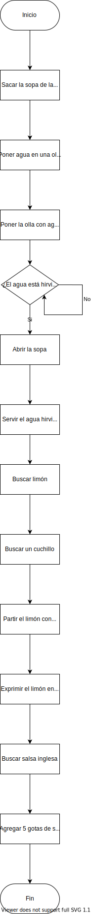

#   Corto 1 - Sopa instantánea
##   Algoritmo de preparación

1.  Sacar la sopa de donde esté guardada
2.  Poner en una olla agua y ponerla a hervir
3.  Cuando el agua esté hirviendo, abrir la sopa y servirle el agua.
4.  Buscar y partir un limón
5.  Exprimir el limón en la sopa
6.  Buscar salsa inglesa
7.  Echar un poco de salsa inglesa a la sopa

##   Diagrama de bloques

<p align="center">
  
</p>


##   Pseudocódigo

```

Objetos: sopa, cuchillo, limón, agua, olla, estufa, salsa_inglesa

De objetos, comprobar que existe sopa
De objetos, seleccionar olla
De olla, ejecutar llenar con:
    De objetos, seleccionar agua
De objetos, seleccionar estufa
De estufa, ejecutar calentar:
    De objetos, seleccionar olla

Si agua está hirviendo seguir, si no repetir línea

De objetos, seleccionar sopa
De sopa, ejecutar abrir sopa
De objetos, seleccionar olla
De olla, ejecutar vaciar en:
    De objetos, seleccionar sopa
De objetos, seleccionar cuchillo
De cuchillo, ejecutar partir:
    De objetos, seleccionar limón
De objetos, seleccionar limón
De limón, ejecutar exprimir en:
    De objetos, seleccionar sopa
De objetos, seleccionar salsa_inglesa
De salsa_inglesa, ejecutar servir 5 en:
    De objetos, seleccionar sopa

```