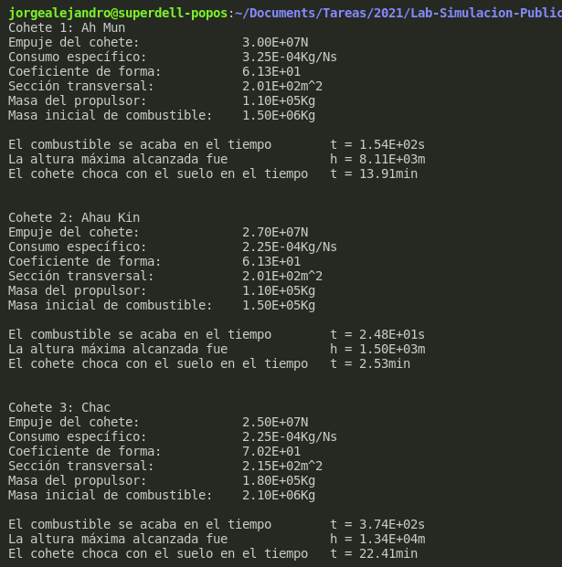

#   Examen Final

Se puede encontrar el código [aquí](C/AdastraReport/AdastraReport.c).
Las gráficas están [aquí](Gnuplot/)

Para correr el código ejecutar dentro de la carpeta [AdastraReport](C/AdastraReport/):

```
gcc AdastraReport.c  -lm -o  AdastraReport  && ./AdastraReport
```

Para plotear, ejecutar el código dentro de la carpeta [Gnuplot](Gnuplot/):

```
gcc AdastraReport.c  -lm -o  AdastraReport  && ./AdastraReport
```

La salida debe verse así:



En este documento, en general tenemos las siguientes variables locales, con usos distintos, pero relacionados:

*   `r` Resultado a retornar de una función
*   `v` Velocidad actual o anterior
*   `t` Tiempo actual o anterior
*   `h` o `y`, altura actual o anterior