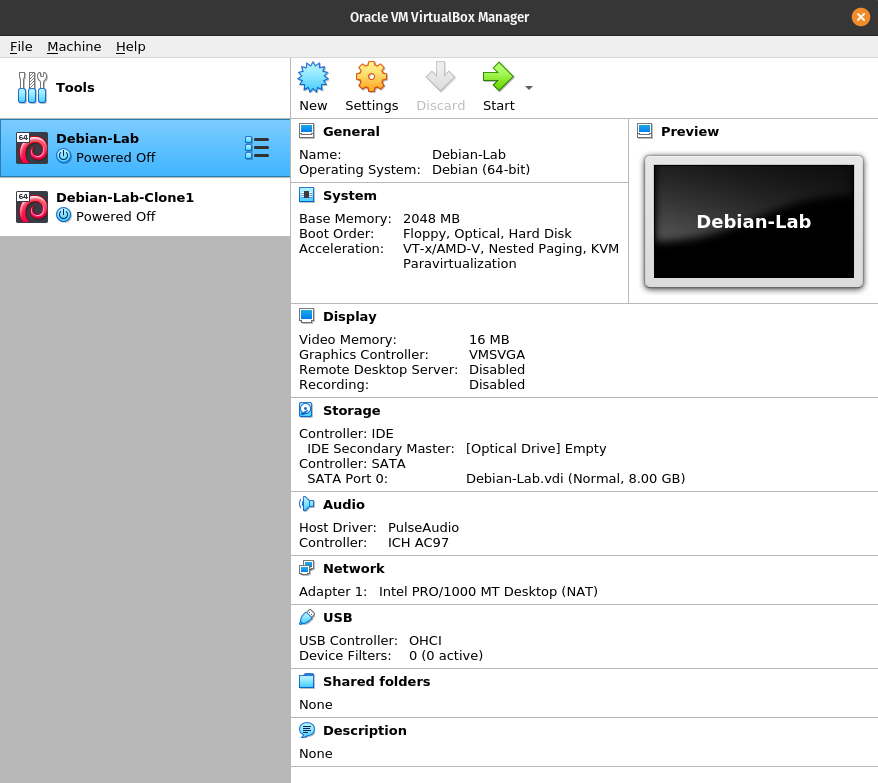
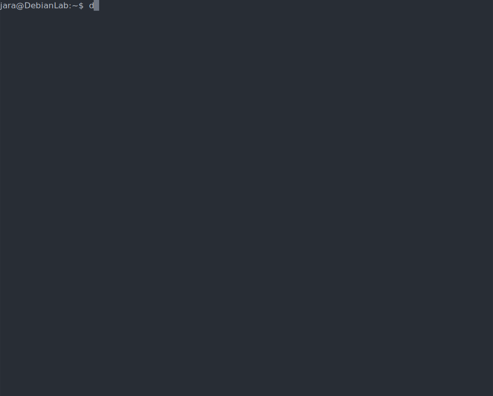

#   Práctica #1
##   Instalación de la maquina virtual
La instalación de la maquina virtual fue sencilla, aunque falló la primera vez, ya que le dí un espacio de almacenamiento muy pequeño.

Sin embargo, la segunda vez todo fue bien. Aunque me sorprendió el tamaño de la ISO, la instalación fue bastante lenta.

Los datos de mi computadora son los siguientes:

Y tras la instalación de Debian en la máquina virtual, y su respectiva clonación tenemos:

##  Entorno de usuario Shell Bash

### Pidiendo ayuda

Tal vez de los comandos más utilizados en Linux, el `-h` y el `man` me parecen una de las cosas más útiles de Linux, ya que puedo acceder a documentación directa de los desarrolladores sin necesidad de buscarla en un navegador. Es eficiente y rápido.

Algo que aprendí nuevo, es el comando `date`, el cual no había usado antes. Me pareció fascinante que pueda solicitar la fecha de otro día colocando una descripción después de `date -d`.

### Instrucciones Básicas

Cuando intente usar el `passwd` intenté poner la misma contraseña por que en realidad no quería cambiarla, y no me dejó, luego intenté poner "1" como contraseña y tampoco me dejó por que era muy corto. Esto fue muy chistoso.

Realicé esto dos veces por que la primera fue muy larga, y al parecer hay un límite para los SVG, así que realicé una más corta pero aún se puede acceder a la larga por este [link](https://asciinema.org/a/391086)

