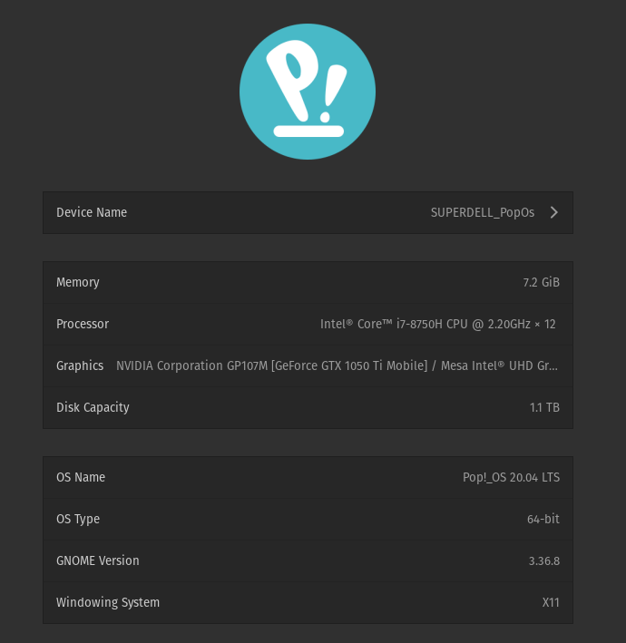
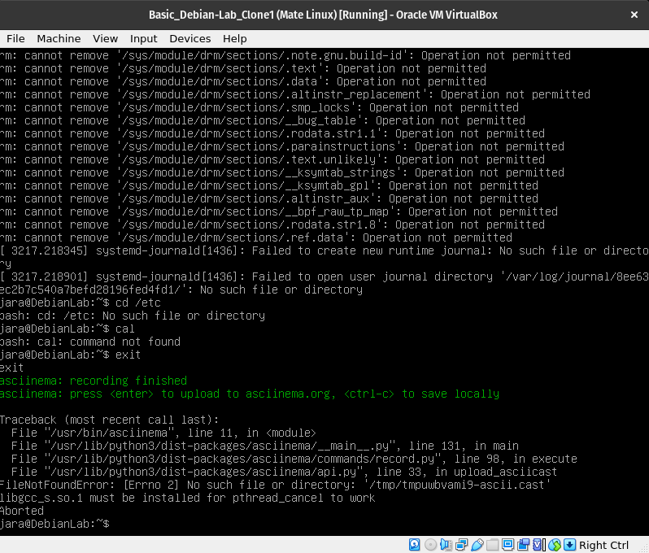

#   Práctica #1
##   Instalación de la maquina virtual
La instalación de la maquina virtual fue sencilla, aunque falló la primera vez, ya que le dí un espacio de almacenamiento muy pequeño.

Sin embargo, la segunda vez todo fue bien. Aunque me sorprendió el tamaño de la ISO, la instalación fue bastante lenta.

Los datos de mi computadora son los siguientes:

Y tras la instalación de Debian en la máquina virtual, y su respectiva clonación tenemos:

##  Entorno de usuario Shell Bash

### Pidiendo ayuda

Tal vez de los comandos más utilizados en Linux, el `-h` y el `man` me parecen una de las cosas más útiles de Linux, ya que puedo acceder a documentación directa de los desarrolladores sin necesidad de buscarla en un navegador. Es eficiente y rápido.

Algo que aprendí nuevo, es el comando `date`, el cual no había usado antes. Me pareció fascinante que pueda solicitar la fecha de otro día colocando una descripción después de `date -d`.

### Instrucciones Básicas

Cuando intente usar el `passwd` intenté poner la misma contraseña por que en realidad no quería cambiarla, y no me dejó, luego intenté poner "1" como contraseña y tampoco me dejó por que era muy corto. Esto fue muy chistoso.

Realicé esto dos veces por que la primera fue muy larga, y al parecer hay un límite para los SVG, así que realicé una más corta pero aún se puede acceder a la larga por este [link](https://asciinema.org/a/391086)

### Sistema de archivos

El movimiento entre carpetas utilizando los comandos `ls` y `cd` es bastante útil, aunque es más eficiente cuando uno conoce las locaciones de los directorios.

En esta primera prueba me muevo entre algunas carpetas, creo un directorio nuevo y lo borro, también creo un archivo de texto en blanco.

Para las siguientes pruebas necesitaba un archivo de texto con algunas lineas de texto, así que escribí en el archivo que cree antes unas 16 lineas de código para hacer las pruebas utilizando `vi` (ya que la instalación de VIM se solicita hasta más adelante).

Con este archivo hago pruebas con los distintos comandos de lectura, en los que se notan diferencias que aunque pueden parecer poco significativas, con archivos de texto más grandes deben ser muy útiles.

También hago movimientos del mismo archivo utilizando comandos distintos.

Ahora jugamos un poco con los permisos, primero copiando la configuración de la práctica, en la que el usuario tiene permisos de ejecución, lectura y escritura; el grupo solo de lectura y ejecución y otros solo de lectura.

Después pasando a que todos tuvieran permisos de escritura y lectura y por último dejando estos permisos solo al usuario y el resto solo permisos de lectura que es la configuración que tiene más sentido para este tipo de archivo.

Después hice la prueba del `which`, probé con algunos de los comandos aprendidos, y todos resultaron estar en el `/usr/bin/*` en una carpeta con el nombre del comando.

Por último, revisé el historial de comandos, y también intenté revisar solo los últimos 10 items de esta lista, sin embargo no funcionó. Tengo una idea de como intentarlo de nuevo en el siguiente capítulo.

### Combinación de instrucciones

Ahora es cuando intentaré realizar la acción de revisar solo los últimos 10 datos del historial, combinando los comandos `history` y `tail`.

Tras haber hecho el intento, no, no funcionó, supongo que tiene que ver con que el comando `tail` necesita un archivo para funcionar y `history` es un comando, no un archivo.

Ahora, intenté combinar otros comandos y con los primeros dos métodos todo fue bien, pero el tercero me costó entender lo que hacía. Y es que en la guía dice *"permite ejecutar **ambas** ordenes aunque la primera falle"*. Sin embargo creo que descubrí que el comando `||` lo que hace es que ejecuta la segunda orden si la primera falla. Esto lo hace mil veces más útil. Por que puedo poner a ejecutar algo, y además tener un respaldo, que si falla, entonces va a hacer otra cosa. Esto es especialmente útil si quiero dejar ejecutando algo muy largo e irme a almorzar.

### grep, ps, kill, find, du

Lo primero que haré será leer los manuales que estos comandos ya traen.
Siempre es mejor aprender probando los comandos y leyendo la documentación más básica, que copiando ejemplos. Vamos a separar esta sección comando por comando:

#### grep

Leyendo el manual `man grep`, me encontré con que *grep* es una función muy útil cuando se trata de buscar palabras en documentos grandes, ya que lo que hace es leer el documento y lo compara con alguna palabra de entrada. Tiene muchas opciones para filtrar y hacer más específica la búsqueda, solo intenté utilizar uno de ellos, para estas funciones más específicas creo que vale más la pena ir a la [documentación](https://www.gnu.org/software/grep/manual/grep.html) del paquete.

#### ps

Este comando, según su manual `man ps`, hace una lista de los procesos activos y da algunos detalles de estos. De nuevo, nos topamos con más opciones de visualización. También nos sugiere el comando `top`, para visualizar los procesos actualizados en tiempo real. Este último es el análogo al monitor del sistema.

Encontré esta [documentación](https://frameworks.readthedocs.io/en/latest/linux/LinuxPs.html), no estoy seguro que sea la oficial, sin embargo me parece bastante buena, es concisa pero tiene las funciones principales de `ps`.

#### kill

Este comando, como su nombre lo indica, mata algún proceso que se esté realizando en la maquina y que por alguna razón alguien quiera detener. Puede ser por que está freezando la computadora en algunos casos, o por que está utilizando muchos recursos. En fin, tiene muchas utilidades. Y va de la mano con el comando `ps` o `top` para saber los procesos que se corren en ese momento. Hice una [grabación](https://asciinema.org/a/391460) que de nuevo fue muy larga, y de cualquier modo no maté ningún proceso. Voy a hacer otra grabación pero esta vez trataré de correr algún proceso para poder matarlo.

#### find
 Como su nombre lo indica, sirve para encontrar directorios, pero contrario a lo que uno pensaría, aquí uno coloca el nombre de la carpeta madre en la que está buscando el directorio después del comando `find`. Por ejemplo `find home` enlista todo el árbol de `home` para que uno pueda leer los directorios en el y así buscar dentro.

 

 #### du
    
Este comando hace una investigación recursiva sobre un directorio, sobre el espacio que utiliza en el disco este directorio. A lo que se refiere con recursiva, es a que entra en cada subdirectorio del directorio y mide el espacio, y recursivamente hasta completar todo el árbol.

Intenté esto con el directorio de pruebas y luego con el directorio de `/usr`, este me dio el tamaño de todo el directorio como también el tamaño de cada subdirectorio. Lamentablemente la salida es muy grande y de nuevo no pude transcribir todo al SVG. Pero aquí un enlace al [**asciicast**](https://asciinema.org/a/391497).

### Package Manager

Después de `-h` y `man`, el instalador de paquetes es el segundo recurso que más utilizo en Linux. El compando varía de distribución en distribución, por que aunque todos los administradores de paquetes pueden ser instalados y tienen el mismo propósito, algunos están diseñados específicamente para cada distribución. Por mi parte he utilizado `pacman`, `pamac`, `rpm`, `dnf`, `apt` y `apt-get`.

Actualicemos el sistema...

Pasó algo extraño, muchas cosas se actualizaron pero entre esas pidió una reinstalación del `grub`. Y pidió otras cosas también. Quedó todo grabado en este [**asciicast**](https://asciinema.org/a/391934), pero de nuevo, es muy largo para ponerlo aquí.

Instalemos `sudo` utilizando `apt`:

Agreguemos mi usuario a los sudoers:

Listo, ahora instalemos `vim` y `git`.

De nuevo es una animación muy pesada, pero la imagen es un enlace:

### Matemos Linux

Para la última parte grabé un video del comando `rm -rf /*` sin usar sudo, y bueno, este si se grabó, aunque se desplegó una lista muy larga y no podré transcribirlo a la animación de nuevo.

Bueno, ahora el momento de la verdad... Intentaré grabarlo, pero dudo que funcione la verdad.

Efectivamente, no logré grabar nada. Extrañamente todo parecía funcionar. Ningún proceso se detuvo, todo terminó de ejecutarse. Incluso, pude detener la grabación después que terminó de borrar todo. Sin embargo, cuando me preguntó si la quería grabar o subir a la nube, murió, y por eso no pude grabar nada. Tengo un screenshot de las últimas líneas.

Este comando básicamente dice:

*     `sudo`: Dale permisos de super usuario
*     `rm -rf`: Remueve, y remueve forzadamente
*     `/*`: Todo el directorio principal (Todo Linux xD)

Por tanto, como era de esperarse, tras este comando todo dejó de funcionar. Ya que los programas y comandos no son más que códigos guardados en algún directorio, al ejecutarlos (o tratar de hacerlo al menos) no son encontrados y pues, por lo tanto, no funcionan. Ni siquiera el comando de apagar la máquina. 

**[Volver a la bitácora](../Journal.md)**

**[Volver al README.md](../../README.md)**

