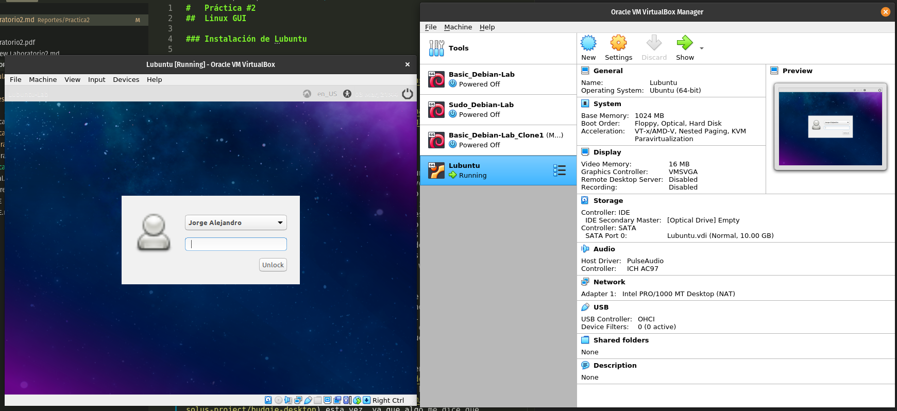
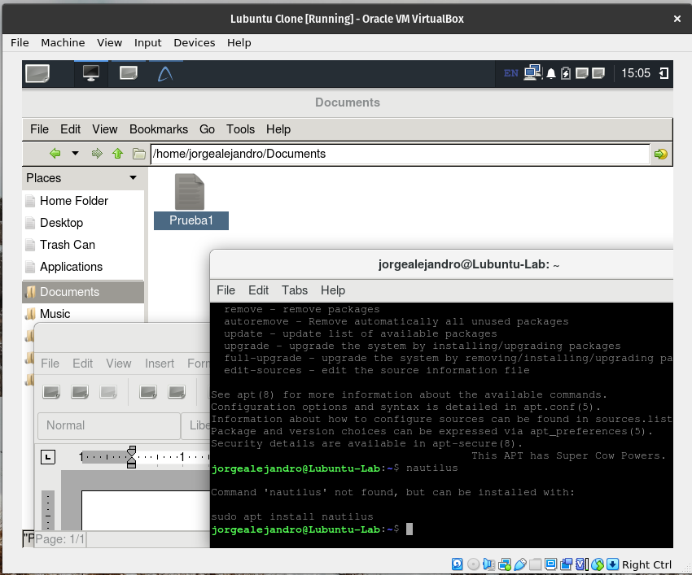

#   Práctica #2
##  Linux GUI

### Instalación de Lubuntu

### Documentación de los entornos de escritorio

*   [KDE plasma](https://kde.org/announcements/plasma/5/5.18.0/)
*   [Mate](https://mate-desktop.com/)
*   [Gnome](https://www.gnome.org/)
*   [Cinnamon](https://projects.linuxmint.com/cinnamon/)
*   [Budgie](https://github.com/solus-project/budgie-desktop)
*   [Xfce](https://www.xfce.org/)

### Elección de un entorno

Como usuario de Linux desde 2018, he tenido oportunidad de probar distintos entornos, aunque no todos, mi favorito, por múltiples razones, aunque todas se resumen a flujo de trabajo, es [Gnome](https://www.gnome.org/), me encanta lo intuitivo que es, lo fácil que es hacer *shortcuts* para acciones específicas, sus escritorios dinámicos son lo mejor, su integración con el track pad (aunque en general, el trackpad funciona mil veces mejor en linux que en windows), pero a su vez su independencia de este, mucho del trabajo que hago cuando utilizo Gnome lo hago solo con el teclado y rara vez utilizo el mouse. Creo que no es el preferido de la comunidad solo por que es de los que más recursos consume, pero yo creo que lo vale; además del hecho que a pesar de su "alto" consumo de recursos, sigue teniendo un consumo muy por debajo del consumo de windows, y se ve diez mil veces mejor.

En general los otros entornos que he probado no me gustan tanto, creo que es por que son muy parecidos a windows, y la verdad, no me gusta nada como Windows se ve. En el colegio pasé mucho tiempo "personalizando" Windows para evitar que se viera tan mal, y nunca logré algo decente con lo poco que se podía hacer. 

Sin embargo, siempre me llamaron la atención los entornos [Budgie](https://github.com/solus-project/budgie-desktop) y [Deepin](https://www.deepin.org/en/dde/). Así que he decidido darle su oportunidad a [Budgie](https://github.com/solus-project/budgie-desktop) esta vez, ya que algo me dice que [Deepin](https://www.deepin.org/en/dde/) al ser más exclusivo para su propia distribución, puede dar algunos problemas. 

### LXDE/LXQT

Este es el entorno que trae por defecto Lubuntu. No lo había utilizado, y a juzgar por lo que vi hoy, pienso que debe ser bastante ligero. Sin embargo, no es de mi agrado.

Entiendo que muchas cosas deben estar como están para evitar que el sistema se sature. Sin embargo, a pesar de tener varios temas para la ventanas, y la posibilidad de cambiar los colores (que no quise mover ya que hay que cambiar cada color a mano y quería ahorrarme problemas de dejar algo ilegible por falta de contraste) ninguno de estos hace que el sistema se vea acorde a su época. Hay temas modernos minimalistas, sin sombreados ni curvas que podrían ser hasta más ligeros que los que trae, pero aún así, todos los temas por defecto se ven muy viejos.

A parte de el como se ve. No me gusta el "inicio", no tiene un buscador (de nuevo supongo que por el rendimiento), y si en algún momento se le agregan muchas aplicaciones supongo que se debe volver difícil encontrarlas. Supongo que (como todo en linux) esto debe tener solución modificando cosas, pero si hacemos un análisis del entorno como es, no me agrada.

¡Los ajustes! Terrible, cada uno debe ser accesado por aparte desde el inicio. Ninguna forma (o no he encontrado hasta ahora al menos) de personalizar *shortcuts*. Ninguna documentación sobre los *shortcuts* existentes, solo investigando en la red.

La terminal. Bueno, es algo que no cambia jaja, así que todo bien.

El navegador de archivos, parecido a Nautilus (el de Gnome), supongo que es algo que tampoco varía tanto en distintos entornos.

Lo mismo para el editor de texto. Aunque es de fondo blanco, y eso no me gusta, pero de nuevo, debe poder personalizarse como todo en linux.

La instalación de aplicaciones visual, terrible, no aparece ni una aplicación si no hasta realizar una búsqueda, y aún buscando, no aparecen todas las aplicaciones.

La documentación de la página de Lubuntu tampoco me gusta. Solo aparece una terminal con comandos sin explicar. No es lo más adecuado para usuarios nuevos en linux. Y aún para usuarios viejos, copiar y pegar código no es algo que se suela hacer, así que al menos explicaciones en comentarios deberían agregar. Claro que uno lo puede investigar, pero no hay nada como una buena documentación que no necesite de más búsquedas. Manjaro y Arch son los ejemplos claros y hermosos de a que me refiero.

Buscando [*shortcuts*](https://manual.lubuntu.me/stable/F/keyboard_shortcuts.html) encontré una [documentación](https://manual.lubuntu.me/stable/) más bonita. Aún así, al menos la [página](https://manual.lubuntu.me/stable/F/keyboard_shortcuts.html) que leí sobre los atajos del teclado, no me agradó, en lugar de utilizar términos como `ctrl+` o `shift+` como cualquier persona normal pondría, los resumen con sus letras iniciales. Y si, lo aclaran al principio, pero de cualquier modo me parece que no les costaba poner las palabras completas.

El único *shortcut* que utilizaría de los que existen sería el de la terminal `ctrl+alt+T`. Y probablemente los cambios de escritorio `ctrl+alt+Left` y `ctrl+alt+Right`. Otros comandos útiles no los encontré, como abrir el navegador o ejecutar un comando. Y como dije antes, tampoco una opción para agregar comandos personalizados.

*Update:* Acabo de encontrar un "programa" donde puedo ver los *shortcuts* y editarlos

**Veredicto:** ¡Terrible! Se parece a Mint (que tampoco me gusta), pero es lo que hay, y es ligero, así que para una máquina viejita está muy bien.

#### Imágenes

### Budgie

*Estado:* Aún no he podido abrir sesión ingresando desde Budgie.

*Actualización:* Logré iniciar sesión con Budgie. Vamos a probarlo.

Con tan solo un giga de ram (menos según el administrador de tareas), se freezó. Apagaré la máquina, y agregaré ram y núcleos. Pero de lo poco que vi, la interfaz es más intuitiva, aún así, los iconos se siguen viendo extremadamente mal, y las ventanas también. Supongo que Budgie no es así cuando se instala una distribución con Budgie desde el principio, asumo que para que se vea bonito hay que hacer la instalación manual de los iconos y demás.

*Actualización* No se había trabado, cuando hice cambios en las dimensiones la detección del mouse se movió y por eso no detectaba donde hacía click. De cualquier manera, aumentaré la ram y continuaré mañana.

Si soy sincero... Tampoco me gustó este entorno. Es más, creo que me gustó aún menos que **LXDE**. Sospecho que es la misma distribución que es muy ligera y de alguna forma instala versiones muy feas de los entornos.

El entorno no se instaló con iconos. Y encontrar el explorador de archivos fue muy difícil a pesar que ahora si tenía la barra de búsqueda. Cuando al fin lo abrí parecía Widows XP jajajaja...

El editor de texto por defecto es *Abiword*, que puede no estar mal para el usuario promedio. Pero la verdad es que prefiero editores de texto plano, *Abiword* tiene herramientas de edición y demás, pero no es bueno para trabajar código o archivos que requieran no tener formatos ocultos.

La terminal, de nuevo, no cambia entre distribuciones.

La configuración, a pesar de estar toda en una sola aplicación con un menú (que esa es mi preferencia personal), era muy limitada, y me hicieron falta muchas más opciones para trastear.

No encontré un listado con shortcuts tampoco. E intenté con los más comunes y no funcionaron. Luego busqué y hay guías pero para Ubuntu Budgie, y algo me dice que esos los agregó Ubuntu por que esta instalación no reacciona a ninguno de esos en su configuración por defecto.

El instalador de software es el de Gnome, que es bastante cómodo, aunque prefiero la terminal. Pero aquí si, un punto a favor de Budgie.

El inicio, pues bastante ordenado, e igual con la barra de búsqueda, así que aquí otro punto a favor.

#### Imagen

Solo tomé un screen, la verdad no había mucho que ver, la pantalla es pequeña, no la quise reconfigurar por que la última vez la posición del puntero se desconfiguró.

## Matemos linux 2.0

A diferencia de la última vez, esta vez no tengo idea de lo que va a pasar... Así que, no se hable más...

Bueno, no pasó nada, los primeros comandos no hicieron nada por que no tenía instalado ninguno de esos paquetes, así que intenté hacer lo mismo pero esta vez usando `budgie-desktop`, pensé que allí moriría pero no. Luego ejecuté el `export PATH=/usr/bin3` pero tampoco murió.

Adjunto aquí las fotos.

