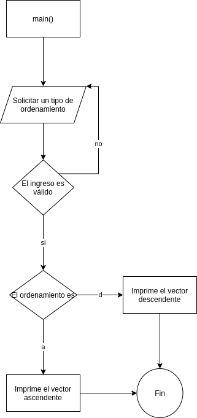

#     Problema_1

>    Debe  de  ingresar  un  vector  de  10  elementos,  llenarlo  de  números  pares  del  2  al  20.  Al  iniciar  el programa debe preguntar al usuario como quiere ver los números, el menú debe de ser por medio de caracteres: “a”verlos de forma ascendente, “d”descendente, en caso que el usuario escriba otro valor debe de decir que no es correcto y preguntarle el carácter nuevamente, hasta que este sea el correcto,al ingresar el valor correcto muestra el vector en pantalla y termina el programa.


##    Documentación para el usuario

Correr el siguiente comando en una terminal:

```bash
gcc Problema_1.c  -lm -o  Problema_1  && ./Problema_1
```


##    Método

Se almacenarán en dos variables, las dos posibles salidas (el vector ascendente y el descendente), y dentro de un loop se ejecutará una misma acción, solicitar al usuario el tipo de ordenamiento, y mientras su respuesta sea incorrecta, el loop se seguirá ejecutando.

##    Variables

###   Entrada

```c
char input;                                 //Variable para almacenar la entrada
```

###   Salida

```c
int a[] = {2,4,6,8,10,12,14,16,18,20};      //Lista ascendente
int d[] = {20,18,16,14,12,10,8,6,4,2};      //Lista descendente
```

###   Otras variables
```c
int state = 0;                              //Variable booleana para determinar si ya se ingresó un valor aceptado
```


##    Diagrama



##    [Código](Problema_1.c)


**[Volver al Laboratorio 4](../../README.md)**