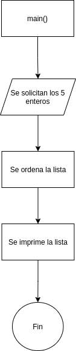

#     Problema_2

>   Crear un programa que solicite al usuario 5 números enteros, estos se deben de guardar en un vector, al terminar de guardar los valores, el programa debe de ordenarlos de forma ascendente y mostrar el vector ordenado. (utilice un método de ordenación.)

##    Documentación para el usuario

Correr el siguiente comando en una terminal:

```bash
gcc Problema_1.c  -lm -o  Problema_1  && ./Problema_1
```

Ingresar uno a uno, los cinco números en la lista que se desea ordenar.

##    Método

Se realizará una función que solicite los 5 números enteros y los almacene en un vector que será una variable global. Después se programará otra función que ordene el vector, con el método de 
burbuja. Y para la impresión del vector se utilizará la función para imprimir arrays del [Problema_1](../Problema_1/).


##    Variables

###   Entrada

```c
int list[5];            //Lista que almacena los 5 valores de entrada
```

###   Salida

```c
int list[5];            //Se usa la misma lista para almacenar los 5 valores de salida
```

###   Otras variables

```c
int i, j;           //Variables locales, utilizadas para conteo
```

##    Diagrama



##    [Código](Problema_2.c)


**[Volver al Laboratorio 4](../../README.md)**