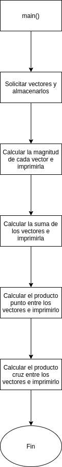

#     Problema_3

> Crear un programa que solicite al usuario dos posiciones en coordenadas (x,y,z) al obtenerlas debe de almacenarlas en dos vectores, el programa automáticamente debe de mostrar los siguientes resultados:
> * Magnitud de cada vector
> * Suma de los dos vectores
> * Producto escalar
> * Producto vectorial

##    Documentación para el usuario

Correr el siguiente comando en una terminal:

```bash
gcc Problema_1.c  -lm -o  Problema_1  && ./Problema_1
```

Ingresar uno a uno los elementos del primer vector.

Ingresar uno a uno los elementos del segundo vector.

##    Método

Se utilizará una variación de la función de solicitud de datos del [Problema_2](../Problema_2/). Se realizaran cuatro funciones, una por cada operación, como la dimensión de los vectores es fija e igual a 3, se realizarán a *formulazo*.

##    Variables

###   Entrada
```c
int v[3];       \\ Primer vector ingresado
int w[3];       \\ Segundo vector ingresado
```

###   Salida

Aunque en el código son funciones, cada una de ellas lleva a una variable de salida:

```c
double mag(int vec[]);      \\ Magnitud de el vector en cuestión
void sum();                 \\ Suma de los vectores
void p_dot();               \\ Producto punto entre los vectores
void p_times();             \\ Producto cruz entre los vectores
```

###   Otras variables

```c
int i, j;               \\ Variables locales de conteo
--- temp;               \\ Variable local que funciona como buffer, es de distinto tipo en cada funcion    
```

##    Diagrama



##    [Código](Problema_3.c)


**[Volver al Laboratorio 4](../../README.md)**