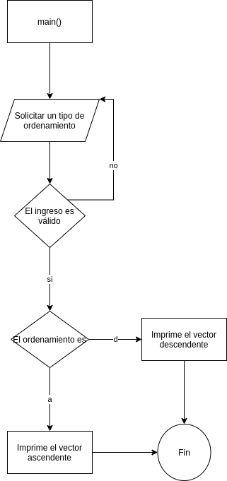
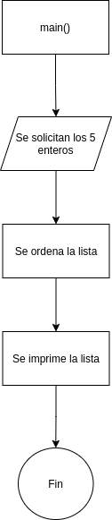
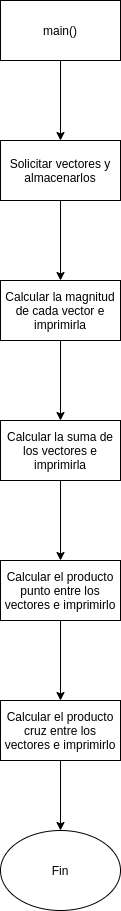

#   Práctica 4


Esta documentación está diseñada para que pueda navegarse dentro de [github](https://github.com/JARA99/LabSimul1S2021JARA/tree/main/Reportes/Practica4) o Visual Studio Code. Y recomiendo que sea leída desde allí.


## Ir a:


* [Problema_1](https://github.com/JARA99/LabSimul1S2021JARA/tree/main/Reportes/Practica4/C/Problema_1)

* [Problema_2](https://github.com/JARA99/LabSimul1S2021JARA/tree/main/Reportes/Practica4/C/Problema_2)

* [Problema_3](https://github.com/JARA99/LabSimul1S2021JARA/tree/main/Reportes/Practica4/C/Problema_3)

* [Problema_4](https://github.com/JARA99/LabSimul1S2021JARA/tree/main/Reportes/Practica4/C/Problema_4)

* [Problema_5](https://github.com/JARA99/LabSimul1S2021JARA/tree/main/Reportes/Practica4/C/Problema_5)

* [Problema_6](https://github.com/JARA99/LabSimul1S2021JARA/tree/main/Reportes/Practica4/C/Problema_6)


#     Problema_1

>    Debe  de  ingresar  un  vector  de  10  elementos,  llenarlo  de  números  pares  del  2  al  20.  Al  iniciar  el programa debe preguntar al usuario como quiere ver los números, el menú debe de ser por medio de caracteres: “a”verlos de forma ascendente, “d”descendente, en caso que el usuario escriba otro valor debe de decir que no es correcto y preguntarle el carácter nuevamente, hasta que este sea el correcto,al ingresar el valor correcto muestra el vector en pantalla y termina el programa.


##    Documentación para el usuario

Correr el siguiente comando en una terminal:

```bash
gcc Problema_1.c  -lm -o  Problema_1  && ./Problema_1
```


##    Método

Se almacenarán en dos variables, las dos posibles salidas (el vector ascendente y el descendente), y dentro de un loop se ejecutará una misma acción, solicitar al usuario el tipo de ordenamiento, y mientras su respuesta sea incorrecta, el loop se seguirá ejecutando.

##    Variables

###   Entrada

```c
char input;                                 //Variable para almacenar la entrada
```

###   Salida

```c
int a[] = {2,4,6,8,10,12,14,16,18,20};      //Lista ascendente
int d[] = {20,18,16,14,12,10,8,6,4,2};      //Lista descendente
```

###   Otras variables
```c
int state = 0;                              //Variable booleana para determinar si ya se ingresó un valor aceptado
```


##    Diagrama



##    [Código](https://github.com/JARA99/LabSimul1S2021JARA/blob/main/Reportes/Practica4/C/Problema_1/Problema_1.c)


#     Problema_2

>   Crear un programa que solicite al usuario 5 números enteros, estos se deben de guardar en un vector, al terminar de guardar los valores, el programa debe de ordenarlos de forma ascendente y mostrar el vector ordenado. (utilice un método de ordenación.)

##    Documentación para el usuario

Correr el siguiente comando en una terminal:

```bash
gcc Problema_1.c  -lm -o  Problema_1  && ./Problema_1
```

Ingresar uno a uno, los cinco números en la lista que se desea ordenar.

##    Método

Se realizará una función que solicite los 5 números enteros y los almacene en un vector que será una variable global. Después se programará otra función que ordene el vector, con el método de 
burbuja. Y para la impresión del vector se utilizará la función para imprimir arrays del [Problema_1](../Problema_1/).


##    Variables

###   Entrada

```c
int list[5];            //Lista que almacena los 5 valores de entrada
```

###   Salida

```c
int list[5];            //Se usa la misma lista para almacenar los 5 valores de salida
```

###   Otras variables

```c
int i, j;           //Variables locales, utilizadas para conteo
```

##    Diagrama



##    [Código](https://github.com/JARA99/LabSimul1S2021JARA/blob/main/Reportes/Practica4/C/Problema_2/Problema_2.c)

#     Problema_3

> Crear un programa que solicite al usuario dos posiciones en coordenadas (x,y,z) al obtenerlas debe de almacenarlas en dos vectores, el programa automáticamente debe de mostrar los siguientes resultados:
> * Magnitud de cada vector
> * Suma de los dos vectores
> * Producto escalar
> * Producto vectorial

##    Documentación para el usuario

Correr el siguiente comando en una terminal:

```bash
gcc Problema_1.c  -lm -o  Problema_1  && ./Problema_1
```

Ingresar uno a uno los elementos del primer vector.

Ingresar uno a uno los elementos del segundo vector.

##    Método

Se utilizará una variación de la función de solicitud de datos del [Problema_2](../Problema_2/). Se realizaran cuatro funciones, una por cada operación, como la dimensión de los vectores es fija e igual a 3, se realizarán a *formulazo*.

##    Variables

###   Entrada
```c
int v[3];       \\ Primer vector ingresado
int w[3];       \\ Segundo vector ingresado
```

###   Salida

Aunque en el código son funciones, cada una de ellas lleva a una variable de salida:

```c
double mag(int vec[]);      \\ Magnitud de el vector en cuestión
void sum();                 \\ Suma de los vectores
void p_dot();               \\ Producto punto entre los vectores
void p_times();             \\ Producto cruz entre los vectores
```

###   Otras variables

```c
int i, j;               \\ Variables locales de conteo
--- temp;               \\ Variable local que funciona como buffer, es de distinto tipo en cada funcion    
```

##    Diagrama



##	[Código](https://github.com/JARA99/LabSimul1S2021JARA/blob/main/Reportes/Practica4/C/Problema_3/Problema_3.c)

#     Problema_4

>   Crear un programa que solicite al usuario dos matrices de 3x3 almacenarlas como (matA, matB) y una constante, el programa automáticamente debe de mostrar las los siguientes resultados:
>
>   1.    matA por constante
>   2.    suma de las dos matrices
>   3.    resta de las dos matrices
>   4.    multiplicación de las dos matrices
>   5.    determinante de matA
>   6.    transpuesta de matB
>   7.    inversa de matA
>   8.    reducción de Gauss de maA
>   9.    reducción de Gauss Jordan de matB


##    Documentación para el usuario

Correr el siguiente comando en una terminal:

```bash
gcc Problema_4.c  -lm -o  Problema_4  && ./Problema_4
```

Ingresar de forma ordenada:

*   Los elementos de matriz de la matriz A
*   Los elementos de matriz de la matriz B
*   La constante

Los elementos de matriz están dados de la siguiente forma:

$$
    M = 
    \begin{pmatrix}
        M_{11} & M_{12} & M_{13}\\
        M_{21} & M_{22} & M_{23}\\
        M_{31} & M_{32} & M_{33}\\
    \end{pmatrix}
$$

Y `M_{ij}` = $M_{ij}$.

##    Método

Se realizarán una serie de funciones, algunas generales, como leer la matriz de entrada, o imprimir la matriz de salida. Y otras específicas a cada inciso.

Se solicitarán los elementos de matriz de las dos matrices y la constante, y luego se realizarán los cálculos.

##    Variables

###   Entrada

```c
double MatA[3][3];    // Almacena la matriz A original
double MatB[3][3];    // Almacena la matriz B original
double cte;           // Almacena la constante
```

###   Salida
```c
double M[3][3];       // Almacena temporalmente la matriz a imprimir
```

### Funciones
```c
//Generales
void InputMatrix(char Mat);         // Lee los elementos de matriz y los almacena
void OutputMatrix();                // Imprime la matriz de salida

//Especificas a cada problema
void MatAxCte();                    // Multiplica cada elemento de la matriz A por una contante e imprime
void MatSum();                      // Suma los elementos de matriz de uno en uno
void MatDif();                      // Resta los elementos de matriz de uno en uno
void MatProd();                     // Realiza el producto entre A y B
void DetA();                        // Calcula el determinante de A
void TranspB();                     // Calcula la transupesta de B
void InvA();                        // Calcula la inversa de A
```

###   Otras variables
```c
int i,j;            // Variables locales de conteo
double r;           // Variable local de almacenamiento
```


##    Pseudocódigo
```c
main():
    Imprime mensaje de ingresar constante
    Lee la constante y la almacena
    Imprime mensaje de lectura de elementos de matriz A
    Lee elemento a elemento y almacena
    Imprime mensaje de lectura de elementos de matriz B
    Lee elemento a elemento y almacena
    Calcula las funciones e imprime sus resultados

MatAxCte():
    Multiplica cada elemento de A, por la constante
    Imprime esta nueva matriz

MatSum():
    Suma A[i][j]+B[i][j] y lo almacena en M[i][j]
    Imprime M

MatDif():
    Resta A[i][j]-B[i][j] y lo almacena en M[i][j]
    Imprime M

MatProd():
    M[i][j] = MatA[i][1]*MatB[1][j]+MatA[i][2]*MatB[2][j]+MatA[i][0]*MatB[0][j]
    Imprime M

DetA():
    det = 
        MatA[1][1]*MatA[2][2]*MatA[3][3]
    +   MatA[2][1]*MatA[3][2]*MatA[1][3]
    +   MatA[1][2]*MatA[2][3]*MatA[3][1]
    -   MatA[3][1]*MatA[2][2]*MatA[1][3]
    -   MatA[1][2]*MatA[2][1]*MatA[3][3]
    -   MatA[1][1]*MatA[2][3]*MatA[3][2]
    Imprime det

TranspB():
    M[i][j]=B[j][i]
    Imprime M

InvA();
    a = 1/DetA()
    M[i][j] = a*A[j][i]
    Imprime M
```

## [Código](https://github.com/JARA99/LabSimul1S2021JARA/blob/main/Reportes/Practica4/C/Problema_4/Problema_4.c)

#     Problema_5

> Crear un programa que encuentre el factorial de un numero entero ingresado, debe de utilizar una función recursiva.

##    Documentación para el usuario

Correr el siguiente comando en una terminal:

```bash
gcc Problema_5.c  -lm -o  Problema_5  && ./Problema_5
```

Ingresar un entero para calcular su factorial.

##    Método

Se realizará una función recursiva que calcule el factorial de una variable, se solicitará una entrada, y se almacenará en la variable a la que se le aplicará esta función.

##    Variables

###   Entrada

```c
int m;          //Almacena el entero de entrada
```

###   Salida

```c
long int r;     //Almacena el entero de salida
```

##    Pseudocódigo

```c
main():
    Solicitar entero n
    Ejecutar función fac(n)
    Imprimir el resultado

fac(n):
    Si n > 1:
        regresar n*fac(n)
    Otro caso:
        regresar 1
```

## [Código](https://github.com/JARA99/LabSimul1S2021JARA/blob/main/Reportes/Practica4/C/Problema_5/Problema_5.c)

#     Problema_6

> Crear un programa que realice la sumatoria desde 1 hasta un número n que ingrese el usuario de las siguientes funciones.
>
> $$
>    \sum^n_{k=1} k^2(k-3) \tag{a}
> $$
>
> $$
>    \sum^n_{k=1} \frac{3}{k-1} \tag{b}
> $$
>
> $$
>    \sum^n_{k=1} \frac{1}{\sqrt{5}}\left(\frac{1+\sqrt{5}}{2}\right)^n-\frac{1}{\sqrt{5}}\left(\frac{1-\sqrt{5}}{2}\right)^n \tag{c}
> $$
>
> $$
>    \sum^n_{k=2} 0.1\left(3*2^{k-2}+4\right)\tag{d}
> $$


##    Documentación para el usuario

Correr el siguiente comando en una terminal:

```bash
gcc Problema_6.c  -lm -o  Problema_6  && ./Problema_6
```

Ingresar un entero para calcular las distintas sucesiones de 1 o 2 hasta este entero.

##    Método

Solicitar el entero n, realizar una función para cada sumatoria, que contenga un for desde 1 o 2 (dependiendo de la sumatoria) hasta n.

Una observación importante, es que la ecuación (b) se indetermina en el primer término, por tanto, la sumatoria se tomará desde 2 hasta n.

Por último, imprimir los valores de las sumas de manera ordenada, y se agregó un detalle, cuando el número es menor a 1, se solicita de nuevo un número, aclarando que debe ser mayor a 0.

##    Variables

###   Entrada

```c
int m;          //Almacena el entero de entrada
```

###   Salida

```c
// Aunque son funciones, son las encargadas de generar y almacenar las salidas. 
int a(int n);       //Salida del problema a
double b(int n);    //Salida del problema b
double c(int n);    //Salida del problema c
double d(int n);    //Salida del problema d
```

##    Pseudocódigo

```c
main():
    Solicitar un entero
    Leer y almacenar el entero
    Determinar si es menor a 1, igual a 1 o mayor a 1

        Si es mayor a 1
            Imprimir los resultados de las funciones a,b,c,d de forma ordenada
        Si es igual a 1
            Imprimir los resultados de las funciones a y c de forma ordenada
            Aclarar que par b y d se necesita un n > 1
        Si es menor a 1
            Solicitar un entero mayor a 1
            Leer y almacenar el entero
```

Para `a()`, `b()`, `c()` y `d()` se usa una estructura parecida, pero se aplica la función de cada inciso:

```c
F(n):
    Declarar una variable local r
    Mientras i <= n, loop y suma 1 a i:
        r = r + f(i)
    regresar r
```

Con `f()` la función matemática del problema en cuestión.

## [Código](https://github.com/JARA99/LabSimul1S2021JARA/blob/main/Reportes/Practica4/C/Problema_6/Problema_6.c)

